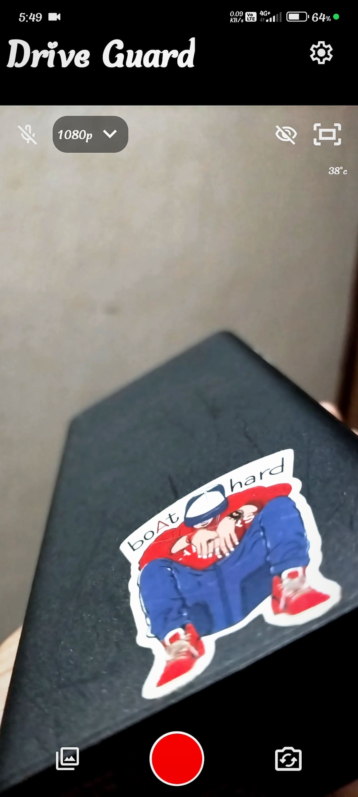
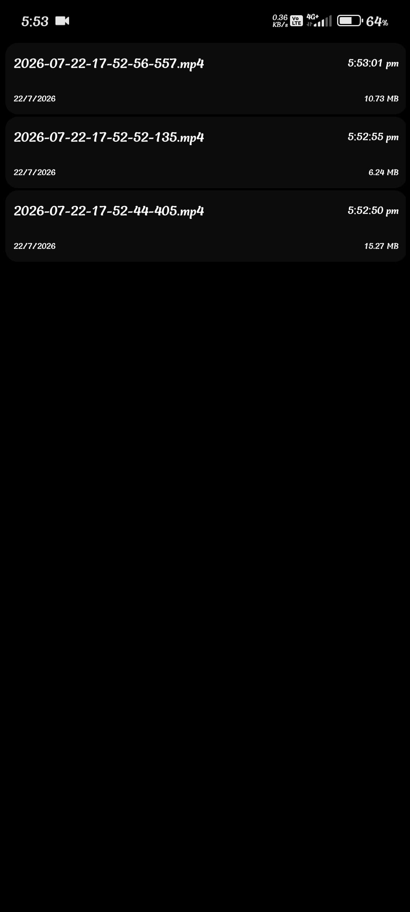
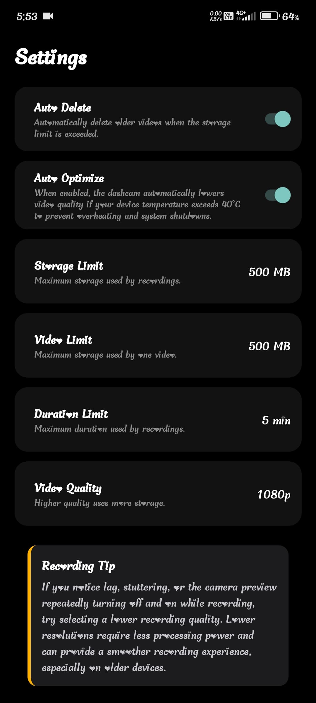

# 🚗 DriveGuard

> A lightweight Android dashcam built with **React Native (Expo SDK 57)** and a custom native camera module for reliable background video recording.

---

## ✨ Features

- 🎥 Continuous background recording
- 🔄 Smart loop recording with automatic storage cleanup
- 📂 Built-in video gallery
- 🖼️ Automatic thumbnail generation
- ⚙️ Adjustable video quality
- 💾 Configurable storage limit
- 🎙️ Optional microphone recording
- 🔋 Battery & thermal optimized
- 🚀 Native CameraX implementation
- 🛡️ Android Foreground Service support

---

## 📱 Preview

| Home | Gallery | Settings |
|:----:|:-------:|:--------:|
|  |  |  |

---

## 🛠 Tech Stack

- **Framework:** React Native (Expo SDK 57)
- **Language:** TypeScript
- **Navigation:** Expo Router
- **State Management:** Zustand
- **Storage:** MMKV
- **Native Module:** Expo Modules API
- **Camera API:** Android CameraX
- **Background Engine:** Android Foreground Service

---

## 🚀 Getting Started

### Prerequisites

- Node.js 18+
- npm
- Android Studio
- Android SDK
- Expo CLI

### Clone the repository

```bash
git clone https://github.com/AdwaithAnandSR/DriveGuard.git
cd DriveGuard
```

### Install dependencies

```bash
npm install
```

### Run on Android

```bash
npx expo run:android
```

> **Note**
>
> DriveGuard uses a custom native module (`expo.modules.drivecam`).
> It **cannot run in Expo Go**.
> Build and run a native development build instead.

---

## 🔐 Required Permissions

| Permission | Purpose |
|------------|---------|
| `android.permission.CAMERA` | Capture video |
| `android.permission.RECORD_AUDIO` | Record dashboard audio |
| `android.permission.FOREGROUND_SERVICE` | Background recording service |
| `android.permission.FOREGROUND_SERVICE_CAMERA` | Camera access while service is running |
| `android.permission.WAKE_LOCK` | Prevent CPU sleep during recording |

---

## 📂 Project Structure

```
DriveGuard
├── android/
├── assets/
├── modules/
│   └── drivecam/
├── preview/
├── src/
├── app.json
├── eas.json
└── package.json
```

---

## 📄 License

This project is licensed under the **MIT License**.

---

## ⭐ Star the Project

If you found this project useful, consider giving it a ⭐ on GitHub.
